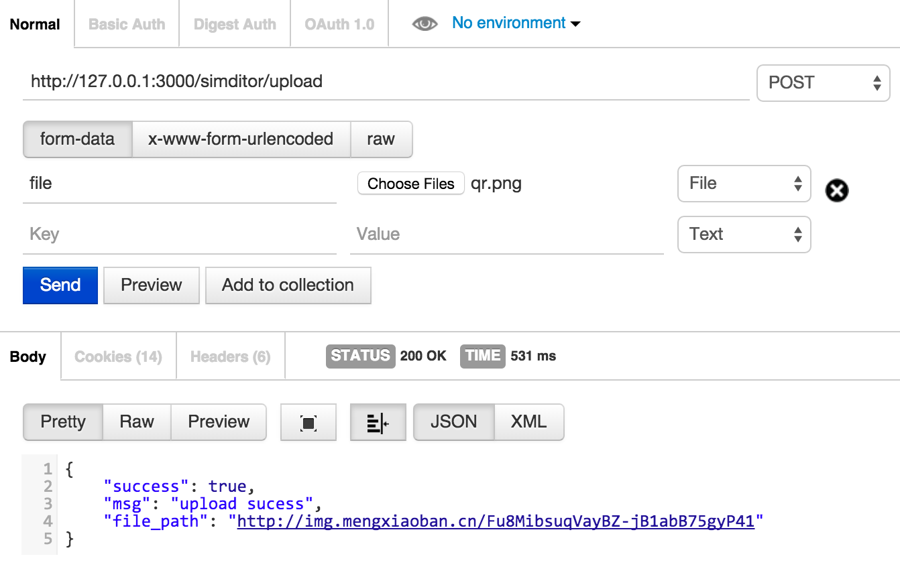

# simditor-qn

[simditor](http://simditor.tower.im/) upload router with qiniu.com for Koa 2.x

Artwork by [i5ting](http://www.github.com/i5ting/).

[](https://david-dm.org/i5ting/simditor-qn) 
[](https://www.npmjs.com/package/simditor-qn)
[](https://raw.githubusercontent.com/i5ting/simditor-qn/master/LICENSE.md)
[](https://www.npmjs.com/package/simditor-qn)


## Install

    npm install --save simditor-qn

## Usage 

```
const Koa = require('koa');
const app = new Koa();

var config = require('../simditor_qn');
require('simditor-qn')(app, simditor_qn_config);

// response
app.use(ctx => {
  ctx.body = 'Hello Koa';
});


app.listen(4000);
```

## Configuration

```
module.exports = {
  path: '/simditor/upload',
  fileKey: 'file',
	multer:{ 
	 	dest: 'uploads/' 
	},
	qn:{
		accessKey: 'xxx',
		secretKey: 'yyy',
		bucket: 'mengxiaoban',
		origin: 'http://{bucket}.u.qiniudn.com',
		// timeout: 3600000, // default rpc timeout: one hour, optional
		// if your app outside of China, please set `uploadURL` to `http://up.qiniug.com/`
		// uploadURL: 'http://up.qiniu.com/',
	},
	url:function(result){
		return "http://img.mengxiaoban.cn/" + result.hash;
	}
}
```

说明

- path    : 默认是'/simditor/upload',是simditor里用到的路径
- fileKey : 默认是'file',是simditor里用到的fileKey
- [multer](https://github.com/expressjs/multer)是expressjs里上传的中间件
- [qn](https://github.com/node-modules/qn)是fengmk2写的七牛的上传模块

## Usage in Simditor

```
var editor = new Simditor({
  textarea: $('#editor'),
  //optional options
  upload: {
      fileObjName: 'file',
      url: '/simditor/upload',
      fileKey: 'file',
      params: {
          "token": window.qn_token
      }
  }
});
```
  

## Test

```
npm test
```

打开Postman界面测试操作如下



## Contributing

1. Fork it
2. Create your feature branch (`git checkout -b my-new-feature`)
3. Commit your changes (`git commit -am 'Add some feature'`)
4. Push to the branch (`git push origin my-new-feature`)
5. Create new Pull Request

## 版本历史

- v1.0.0 初始化版本

## 欢迎fork和反馈

- write by `i5ting` i5ting@126.com

如有建议或意见，请在issue提问或邮件

## License

this repo is released under the [MIT
License](http://www.opensource.org/licenses/MIT).
